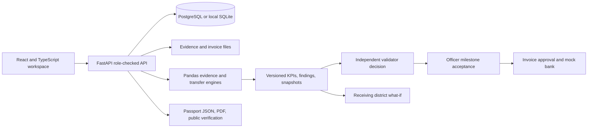

# PilotProof

PilotProof is a synthetic demonstration of evidence-backed public innovation pilots. It keeps measured evidence, independent validation, milestone acceptance, simulated payment and receiving-district transfer checks in one traceable workflow.

> **Structured project record. Not a government certification.** Demo settlement is simulated. No real funds move.

## Start in three commands

Run these from this folder with Docker Desktop available:

```powershell
docker compose up -d postgres
docker compose run --rm backend alembic upgrade head
docker compose up --build backend frontend
```

Open the frontend at `http://localhost:5173`. API documentation is at `http://localhost:8000/api/docs`.

## Demo roles

All local demo accounts use password `demo1234`.

| Role | Email | Main actions |
|---|---|---|
| Officer | `officer@pilotproof.dev` | Accept independently validated milestones; manage challenges |
| Startup applicant | `startup@pilotproof.dev` | Submit evidence and invoices |
| Evaluator | `evaluator@pilotproof.dev` | Review applications |
| Validator | `validator@pilotproof.dev` | Independently validate evidence; assess transfer |
| Finance | `finance@pilotproof.dev` | Approve invoices; initiate and confirm simulated payments |
| Receiving district | `district@pilotproof.dev` | Compare local conditions with pilot evidence |

## Architecture



## Simulated vs real

| Capability | Demo behavior | Production status |
|---|---|---|
| Authentication | Local demo accounts and role claims | No external identity provider configured |
| Evidence analysis | Pandas recomputes KPIs from uploaded CSV rows | Measurement validity still depends on source data and locked plan |
| Audit hashes | Detect record/file changes along the stored chain | A hash does not prove a claim is truthful |
| Payment | Mock reference; idempotent request and explicit confirmation state | No bank integration and no real funds move |
| Funding | Tracks milestone amounts and acceptance | Platform does not hold or disburse public funds |
| District transfer | Rule-based comparison and live synthetic what-if preview | Does not approve procurement or guarantee deployment success |
| Violet assistant | Uses saved project record text and cites those sections | No general-purpose model answer is treated as evidence |
| Public verify | Redacted summary and current evidence hash check | Not a government certificate or legal attestation |

## Payment and transfer rules

The milestone finance endpoints enforce `Evidence submitted → Validated → Accepted → Invoice approved → Payment initiated → Payment confirmed`. Generic lifecycle and legacy payment routes cannot jump into protected finance states or initiate an unlinked payment. An idempotency key reuses the same mock-bank reference.

The transfer screen compares daily volume, connectivity, language mix, infrastructure, staffing, security requirements and product version. Each dimension returns **Evidence reusable**, **Additional test needed**, or **Not demonstrated** with a reason. Technical suitability and procurement-route approval are separate outputs. The Gadchiroli preview can lower bandwidth below the pilot's locked threshold and produce a low-bandwidth retest requirement.

## Limitations

- Synthetic demo data is illustrative. Replace it with approved measurement plans and attributable field records before real operational use.
- The app is a prototype, not a procurement, finance, identity, or compliance authority.
- The PDF package is a concise generated record. Reviewers should retain source files and independently verify calculations.
- The assistant summarizes saved record fields; it does not establish facts absent from those records.
- Policy-source history, approver identity, QR generation, and newer-policy diffs depend on complete policy records and are not fully populated in this demo.
- Configure production secrets, access controls, secure object storage, retention, backups, monitoring and a real identity provider before deployment.

## Verification checklist

Current automated checks cover:

- KPI traceability and reproducible calculations from source rows.
- Duplicate and missing-period detection.
- Missing evidence vs failed performance vs passed outcomes.
- Backend denial of self-validation and role-inappropriate actions.
- Stale-result invalidation after a new evidence version.
- Transfer mismatch decisions and the Gadchiroli bandwidth boundary.
- Payment state order, invoice gating, idempotent initiation and simulated confirmation.

The decision-package endpoint provides the current portable project snapshot. Time-to-assemble a package has not been measured against a manual baseline; no speed claim is made.
